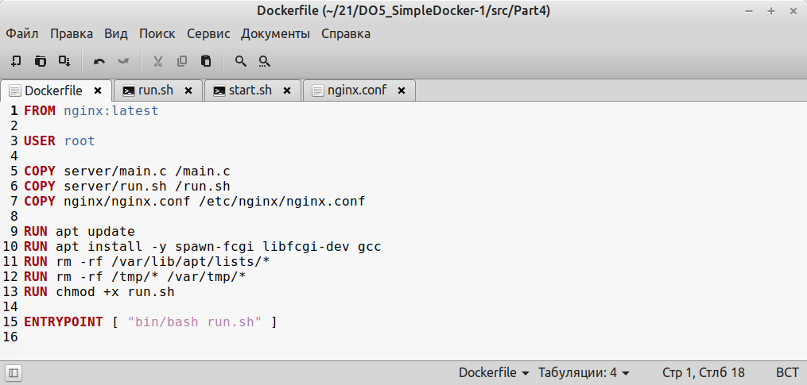
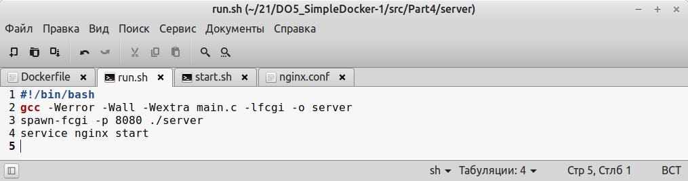
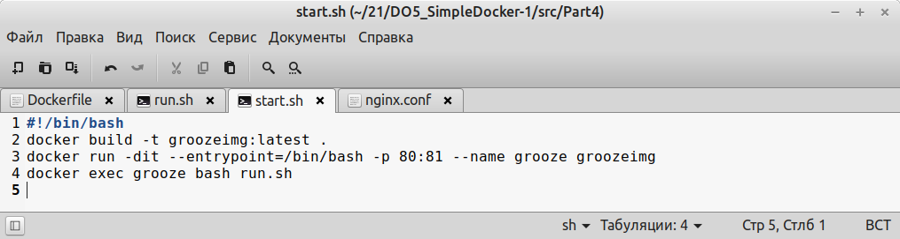
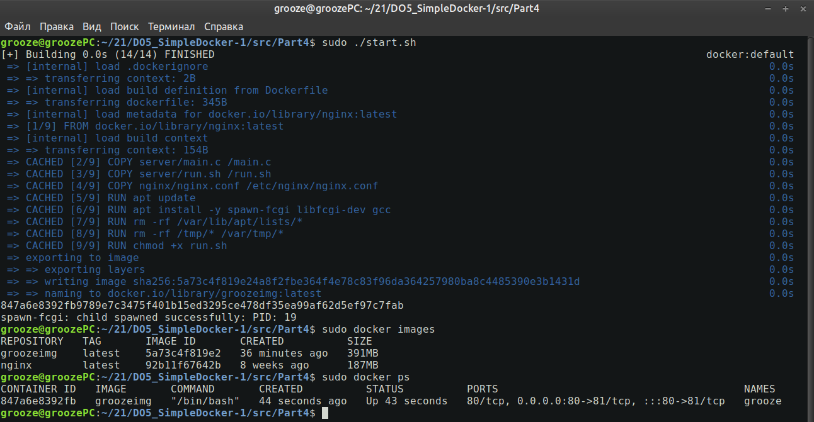
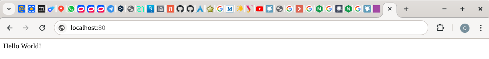
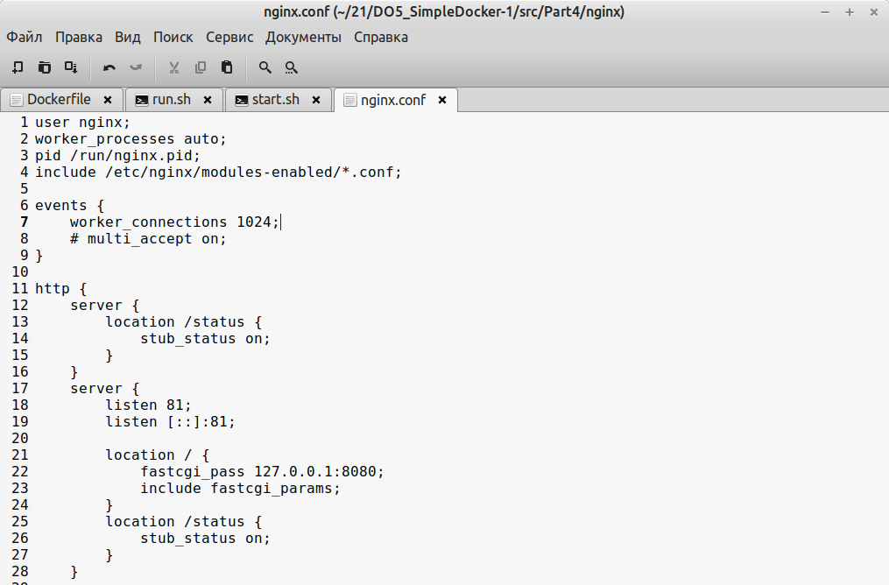
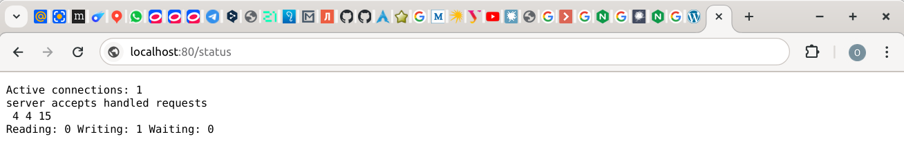

## Part IV
### Написать свой докер образ

- собирает исходники мини сервера на FastCgi из Части 3

- запускает его на 8080 порту

- копирует внутрь образа написанный ./nginx/nginx.conf

- запускает nginx.

- Собрать написанный докер образ через docker build при этом указав имя и тег

- Проверить через docker images, что все собралось корректно

- Запустить собранный докер образ с маппингом 81 порта на 80 на локальной машине и маппингом папки ./nginx внутрь контейнера по адресу, где лежат конфигурационные файлы nginx'а (см. Часть 2)

- Проверить, что по localhost:80 доступна страничка написанного мини сервера

- Дописать в ./nginx/nginx.conf проксирование странички /status, по которой надо отдавать статус сервера nginx

- Проверить, что теперь по localhost:80/status отдается страничка со статусом nginx

