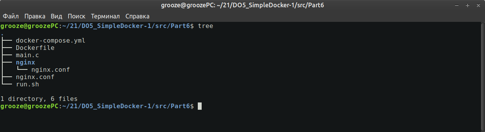
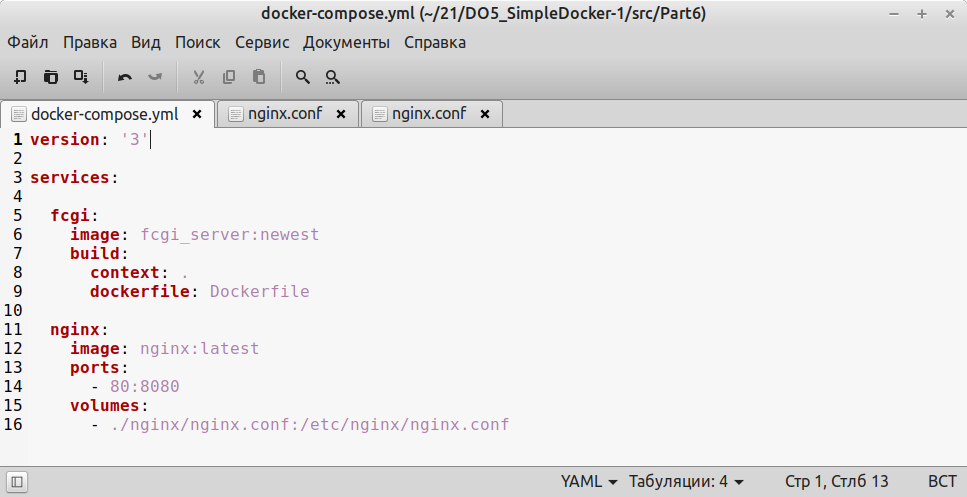
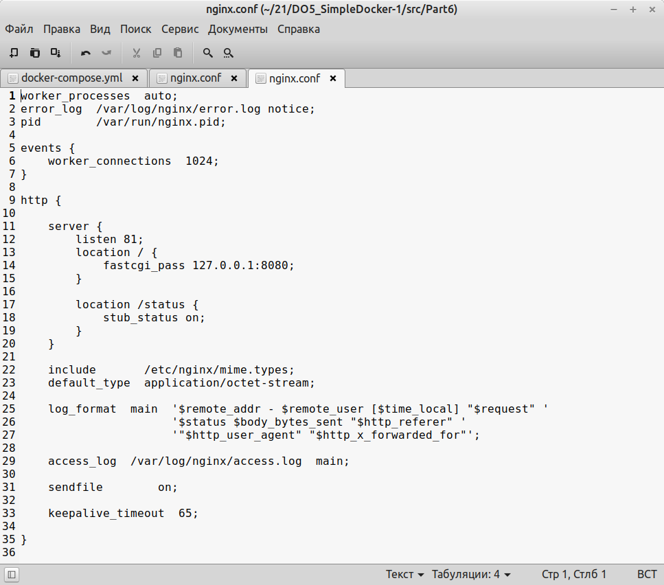
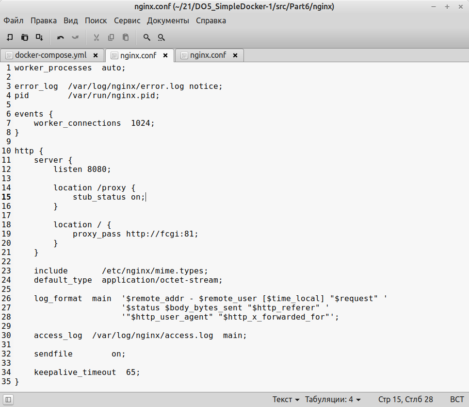
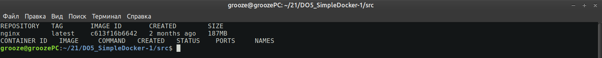
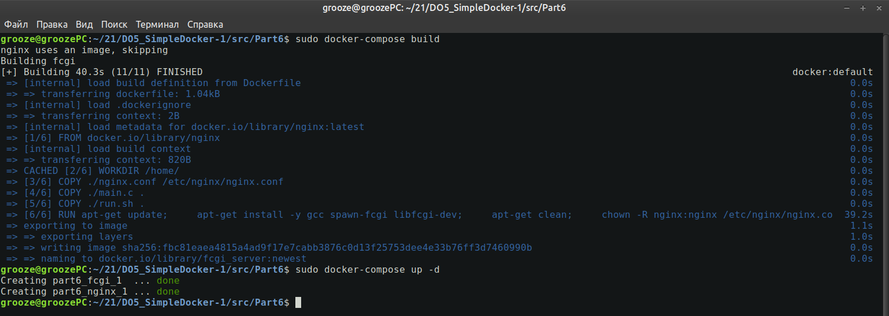
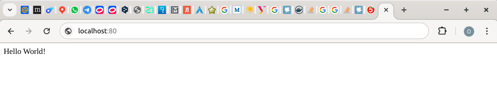

## Part VI
### Базовый Docker Compose

- Написать файл docker-compose.yml, с помощью которого:

- Поднять докер контейнер из Части 5 (он должен работать в локальной сети, т.е. не нужно использовать инструкцию EXPOSE и мапить порты на локальную машину)

- Поднять докер контейнер с nginx, который будет проксировать все запросы с 8080 порта на 81 порт первого контейнера
- Замапить 8080 порт второго контейнера на 80 порт локальной машины

- Остановить все запущенные контейнеры

- Собрать и запустить проект с помощью команд docker-compose build и docker-compose up

- Проверить, что в браузере по localhost:80 отдается написанная вами страничка, как и ранее

